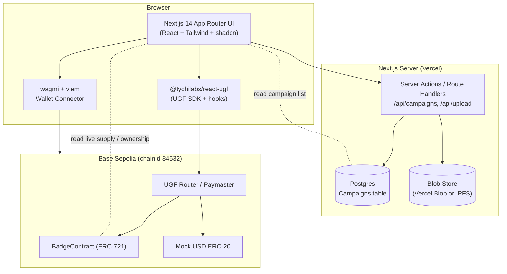
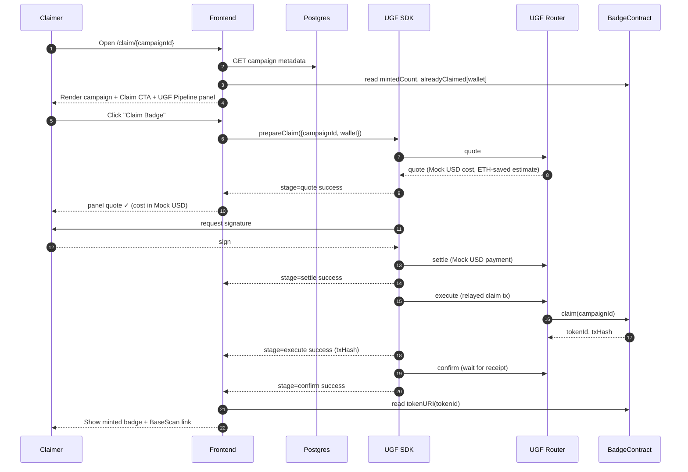
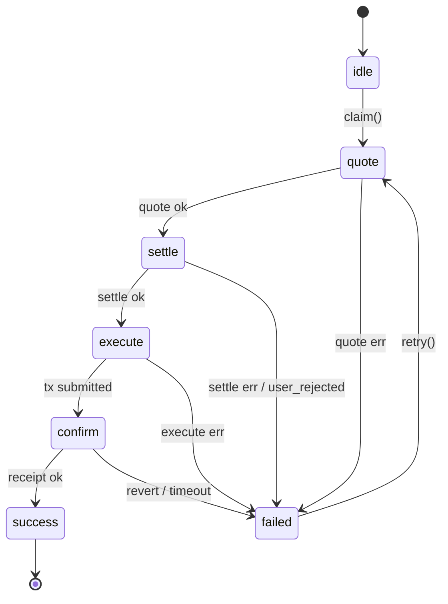
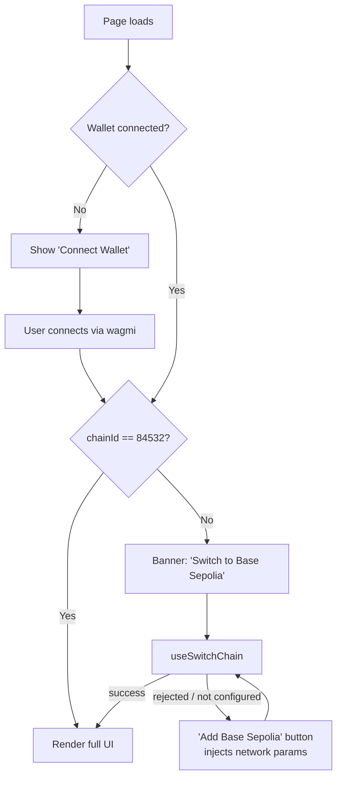
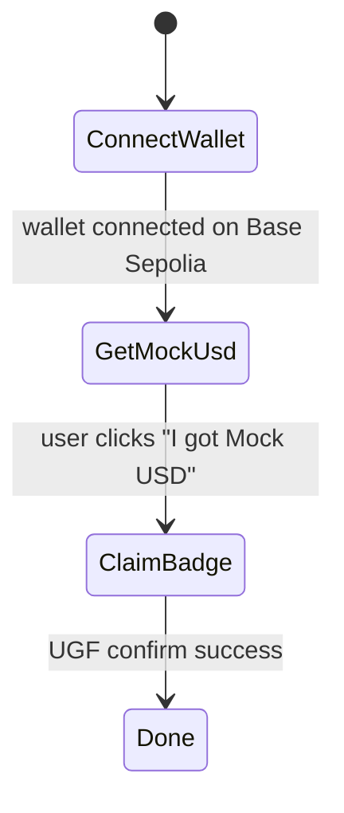

# Design Document

## Overview

Proof is a Next.js 14 App Router dApp that issues gasless POAP-style achievement badges on Base Sepolia. Every on-chain write (campaign creation, badge claim) flows through the Universal Gas Framework (UGF) Testnet SDK so users pay gas in Mock USD instead of ETH. A live four-stage UGF Pipeline panel renders on every transaction so judges can visibly confirm the "no ETH needed" experience.

The system has three logical layers:

1. **Frontend** (Next.js 14 App Router + TypeScript): UI, wallet connection, UGF pipeline rendering, server actions for metadata persistence.
2. **Metadata layer** (Postgres + Blob/IPFS): off-chain storage of human-readable campaign data and images. The on-chain contract holds only the fields it needs to enforce claims.
3. **On-chain layer** (Single ERC-721 `BadgeContract` on Base Sepolia): mints badges, enforces supply, claim window, one-claim-per-wallet, and soulbound semantics.

The single most important design decision is the **single contract / many campaigns** model. Instead of deploying a contract per campaign, one `BadgeContract` stores a `Campaign` struct keyed by `campaignId` and mints all badges with a `(campaignId, tokenId)` mapping. This keeps creator UX gasless and instantaneous (one transaction to register a campaign, no factory deploy), and matches the metadata store's keying.

The second decisive choice is **off-chain metadata, on-chain enforcement**. Names, descriptions, and images live in Postgres + blob storage. On-chain fields are limited to what the contract needs to authorize a mint: `maxSupply`, `mintedCount`, `startTime`, `endTime`, `soulbound`, and `creator`. This keeps claim-time calldata small and gas predictable through UGF.

Hackathon discipline: no factory contracts, no IPFS pinning workers, no AI agent (explicitly out of scope per requirements). Every component on screen exists to make the UGF moment land.

## Architecture

### High-level component diagram



### Request flow: gasless claim



### Tech stack

| Concern | Choice | Rationale |
|---|---|---|
| Frontend framework | Next.js 14 App Router + TypeScript | Server actions, route handlers, and edge-friendly hosting in one app. |
| Styling | Tailwind CSS + shadcn/ui | Fast, polished UI with accessible primitives. Hackathon-grade visuals out of the box. |
| Wallet | wagmi v2 + viem | Industry standard, integrates cleanly with @tychilabs/react-ugf. |
| Gasless layer | `@tychilabs/react-ugf` over `@tychilabs/ugf-testnet-js` | Required by the hackathon track. Provides hooks for the four-stage pipeline. |
| Database | Hosted Postgres (Vercel Postgres / Neon) | One-click setup, serverless-friendly, supports JSON columns for future flexibility. |
| Blob storage | Vercel Blob (default), with adapter for IPFS via web3.storage | Vercel Blob is fastest to ship; adapter pattern keeps IPFS as a stretch goal. |
| ORM / DB client | `drizzle-orm` + `postgres` | Type-safe, lightweight, no migration surprises. |
| QR generation | `qrcode` (server) + canvas-render fallback (client) | PNG download in one call. |
| Smart contract | Solidity 0.8.24, single ERC-721 (`BadgeContract`) | Solady or OpenZeppelin ERC-721 base. Hardhat or Foundry for tests + deploy. |
| Contract testing | Foundry (preferred) or Hardhat + viem | Foundry's `vm.expectRevert` is ideal for soulbound enforcement tests. |

### Route structure

```
app/
  layout.tsx                # Providers: wagmi, react-ugf, theme
  page.tsx                  # / Discovery view
  claim/[campaignId]/page.tsx
  me/page.tsx               # Connected wallet's badges
  profile/[address]/page.tsx
  creator/page.tsx          # Creator dashboard (list)
  creator/new/page.tsx      # Campaign creation form
  api/
    campaigns/route.ts      # POST create, GET list
    campaigns/[id]/route.ts # GET single
    upload/route.ts         # POST image upload (multipart)
```

## Components and Interfaces

### Frontend components

| Component | Path | Responsibility |
|---|---|---|
| `Providers` | `app/providers.tsx` | wagmi + react-ugf + QueryClient providers. |
| `WalletButton` | `components/wallet-button.tsx` | Connect / disconnect / network switch UI. |
| `NetworkGuard` | `components/network-guard.tsx` | Disables children + banner when chainId ≠ 84532. |
| `MockUsdBalance` | `components/mock-usd-balance.tsx` | Header chip showing Mock USD balance with "Get Mock USD" button. |
| `UgfPipelinePanel` | `components/ugf-pipeline-panel.tsx` | Four-stage visual pipeline driven by `useUgfPipeline()` state. |
| `ClaimCard` | `components/claim-card.tsx` | Renders campaign on `/claim/[id]`, owns claim CTA + onboarding step state. |
| `OnboardingSteps` | `components/onboarding-steps.tsx` | "Connect → Get Mock USD → Claim" three-step indicator. |
| `BadgeGrid` | `components/badge-grid.tsx` | Groups badges by campaign, renders soulbound indicator. |
| `CampaignCard` | `components/campaign-card.tsx` | Discovery + dashboard card with status pill (`upcoming`/`active`/`ended`/`sold_out`). |
| `DiscoveryGrid` | `components/discovery-grid.tsx` | Discovery list with debounced search filter. |
| `CampaignForm` | `components/campaign-form.tsx` | Creator form with validation (zod) + image upload. |
| `QrDownloadButton` | `components/qr-download-button.tsx` | Renders + downloads PNG QR for a Claim_Link. |

### Hooks

| Hook | Returns | Notes |
|---|---|---|
| `useCampaign(id)` | `{ campaign, supply, alreadyClaimed, status, isLoading }` | Joins DB read + on-chain reads. |
| `useUgfClaim()` | `{ claim, pipeline, retry, reset }` | Wraps `useUgfTransaction` from react-ugf for the `claim(campaignId)` call. |
| `useUgfCreateCampaign()` | `{ create, pipeline, retry }` | Wraps the same SDK for `createCampaign(...)`. |
| `useMockUsdBalance()` | `{ balance, refresh }` | Polls every 5s when faucet flow is active, otherwise on focus. |
| `useOwnedBadges(address)` | `{ badges, isLoading }` | Reads `balanceOf` + `tokenOfOwnerByIndex` in batch via viem multicall. |
| `useNetworkGuard()` | `{ isCorrectNetwork, switchToBaseSepolia, addBaseSepolia }` | Wraps wagmi's `useSwitchChain`. |

### Server-side interfaces (Route handlers / server actions)

```ts
// /api/campaigns (POST) — called only after on-chain createCampaign confirms.
type CreateCampaignBody = {
  campaignId: string;          // bigint as decimal string from on-chain event
  name: string;                // 1..80 chars
  description: string;         // 0..500 chars
  imageUrl: string;            // returned by /api/upload
  maxSupply: number;           // 1..10000
  startTime: number;           // unix seconds
  endTime: number;             // unix seconds
  soulbound: boolean;
  creator: `0x${string}`;
};

// /api/campaigns (GET) — discovery list.
type CampaignListItem = {
  campaignId: string;
  name: string;
  description: string;
  imageUrl: string;
  maxSupply: number;
  startTime: number;
  endTime: number;
  soulbound: boolean;
  creator: `0x${string}`;
  createdAt: number;
};

// /api/upload (POST, multipart/form-data, field: "file")
type UploadResponse = { url: string };
```

Validation: `zod` schemas shared between client and server. Image upload validates extension allowlist (`png`, `jpg`, `jpeg`, `webp`, `gif`), 2 MB cap, and **magic-byte sniffing** (read first 12 bytes server-side) to satisfy Requirement 5.6.

### UGF SDK integration approach

`@tychilabs/react-ugf` exposes a `useUgfTransaction` hook (or equivalent) that takes a target contract call and emits per-stage state. The integration boundary is one custom hook per on-chain action:

```ts
// hooks/useUgfClaim.ts
export function useUgfClaim() {
  const { sendTransaction, stage, error, txHash, quote } = useUgfTransaction({
    chainId: 84532,
    to: BADGE_CONTRACT_ADDRESS,
    abi: badgeAbi,
    functionName: "claim",
  });

  const claim = (campaignId: bigint) =>
    sendTransaction({ args: [campaignId] });

  // Pipeline state mapped to four UI stages:
  //   stage = "idle" | "quote" | "settle" | "execute" | "confirm" | "success" | "failed"
  // We translate to the panel’s {pending, active, success, failed} per stage.
  return { claim, stage, error, txHash, quote, retry, reset };
}
```

The `UgfPipelinePanel` is a pure presentational component fed by a normalized `PipelineState` derived from the SDK's stage output. This isolation lets us unit-test stage-mapping logic without mocking the SDK.

If the SDK shape differs from this snippet, the only file that changes is `hooks/useUgfClaim.ts` — call sites stay identical.

## Data Models

### Postgres schema

```sql
-- campaigns: one row per Campaign, keyed by on-chain campaignId.
CREATE TABLE campaigns (
  campaign_id   NUMERIC(78,0) PRIMARY KEY,           -- uint256 fits in NUMERIC(78,0)
  name          VARCHAR(80)   NOT NULL,
  description   VARCHAR(500)  NOT NULL DEFAULT '',
  image_url     TEXT          NOT NULL,
  max_supply    INTEGER       NOT NULL CHECK (max_supply BETWEEN 1 AND 10000),
  start_time    BIGINT        NOT NULL,              -- unix seconds
  end_time      BIGINT        NOT NULL,              -- unix seconds
  soulbound     BOOLEAN       NOT NULL,
  creator       CHAR(42)      NOT NULL,              -- 0x-prefixed checksum address
  created_at    TIMESTAMPTZ   NOT NULL DEFAULT now(),
  CONSTRAINT window_valid CHECK (end_time > start_time)
);

CREATE INDEX campaigns_created_at_idx ON campaigns (created_at DESC);
CREATE INDEX campaigns_creator_idx    ON campaigns (creator);
CREATE INDEX campaigns_name_lower_idx ON campaigns (LOWER(name) text_pattern_ops);
```

Notes:
- `campaign_id` mirrors the on-chain `uint256`. Stored as `NUMERIC(78,0)` to preserve precision; the API layer serializes as decimal strings.
- `name_lower` index supports the case-insensitive substring search in Requirement 12.3.
- No `minted_count`, `claim_count`, or `tx_hash` columns — those are read live from chain.

### Drizzle model

```ts
export const campaigns = pgTable("campaigns", {
  campaignId: numeric("campaign_id", { precision: 78, scale: 0 }).primaryKey(),
  name: varchar("name", { length: 80 }).notNull(),
  description: varchar("description", { length: 500 }).notNull().default(""),
  imageUrl: text("image_url").notNull(),
  maxSupply: integer("max_supply").notNull(),
  startTime: bigint("start_time", { mode: "number" }).notNull(),
  endTime: bigint("end_time", { mode: "number" }).notNull(),
  soulbound: boolean("soulbound").notNull(),
  creator: char("creator", { length: 42 }).notNull(),
  createdAt: timestamp("created_at", { withTimezone: true }).defaultNow().notNull(),
});
```

### On-chain storage (`BadgeContract`)

```solidity
struct Campaign {
    address  creator;       // creator wallet
    uint96   maxSupply;     // packs with creator into one slot
    uint96   mintedCount;   // packs with startTime into next slot
    uint64   startTime;     // unix seconds
    uint64   endTime;       // unix seconds
    bool     soulbound;     // 1 byte
    bool     exists;        // discriminator (default false)
}

mapping(uint256 => Campaign)                 public campaigns;        // campaignId => Campaign
mapping(uint256 => mapping(address => bool)) public hasClaimed;        // campaignId => wallet => claimed
mapping(uint256 => uint256)                  public tokenIdToCampaign; // tokenId => campaignId
mapping(uint256 => string)                   public campaignBaseURI;   // campaignId => off-chain JSON URL

uint256 public nextCampaignId; // monotonic
uint256 public nextTokenId;    // monotonic, shared across campaigns
```

`campaignId` and `tokenId` are both globally monotonic. `tokenURI(tokenId)` returns `campaignBaseURI[tokenIdToCampaign[tokenId]]` (one metadata file per campaign — all badges in a campaign share metadata, which is correct POAP semantics).

### Public types (shared between client and server)

```ts
export type CampaignStatus = "upcoming" | "active" | "ended" | "sold_out";

export type Campaign = {
  campaignId: string;        // decimal string of uint256
  name: string;
  description: string;
  imageUrl: string;
  maxSupply: number;
  startTime: number;         // unix seconds
  endTime: number;           // unix seconds
  soulbound: boolean;
  creator: `0x${string}`;
  createdAt: number;         // unix seconds
};

export type CampaignLive = Campaign & {
  mintedCount: number;       // from chain
  alreadyClaimed?: boolean;  // from chain, only when wallet connected
  status: CampaignStatus;    // derived
};
```

Status derivation (pure function, easy to property-test):

```ts
export function deriveStatus(c: { startTime: number; endTime: number; maxSupply: number; mintedCount: number }, now: number): CampaignStatus {
  if (c.mintedCount >= c.maxSupply) return "sold_out";
  if (now < c.startTime) return "upcoming";
  if (now >= c.endTime)  return "ended";
  return "active";
}
```

## BadgeContract specification

```solidity
// SPDX-License-Identifier: MIT
pragma solidity ^0.8.24;

import {ERC721} from "openzeppelin-contracts/token/ERC721/ERC721.sol";

contract BadgeContract is ERC721 {
    error CampaignNotFound();
    error NotStarted();
    error Ended();
    error SoldOut();
    error AlreadyClaimed();
    error SoulboundTransfer();
    error InvalidWindow();
    error InvalidSupply();

    event CampaignCreated(uint256 indexed campaignId, address indexed creator);
    event BadgeClaimed(uint256 indexed campaignId, address indexed claimer, uint256 indexed tokenId);

    // ... storage from Data Models section ...

    function createCampaign(
        uint96 maxSupply,
        uint64 startTime,
        uint64 endTime,
        bool soulbound,
        string calldata baseURI
    ) external returns (uint256 campaignId) {
        if (maxSupply == 0 || maxSupply > 10_000) revert InvalidSupply();
        if (endTime <= startTime) revert InvalidWindow();
        campaignId = ++nextCampaignId;
        campaigns[campaignId] = Campaign({
            creator: msg.sender,
            maxSupply: maxSupply,
            mintedCount: 0,
            startTime: startTime,
            endTime: endTime,
            soulbound: soulbound,
            exists: true
        });
        campaignBaseURI[campaignId] = baseURI;
        emit CampaignCreated(campaignId, msg.sender);
    }

    function claim(uint256 campaignId) external returns (uint256 tokenId) {
        Campaign storage c = campaigns[campaignId];
        if (!c.exists)                       revert CampaignNotFound();
        if (block.timestamp < c.startTime)   revert NotStarted();
        if (block.timestamp >= c.endTime)    revert Ended();
        if (c.mintedCount >= c.maxSupply)    revert SoldOut();
        if (hasClaimed[campaignId][msg.sender]) revert AlreadyClaimed();

        hasClaimed[campaignId][msg.sender] = true;
        c.mintedCount += 1;
        tokenId = ++nextTokenId;
        tokenIdToCampaign[tokenId] = campaignId;
        _safeMint(msg.sender, tokenId);
        emit BadgeClaimed(campaignId, msg.sender, tokenId);
    }

    function tokenURI(uint256 tokenId) public view override returns (string memory) {
        _requireOwned(tokenId);
        return campaignBaseURI[tokenIdToCampaign[tokenId]];
    }

    /// Soulbound enforcement: revert all transfers (except mint = from address(0)).
    function _update(address to, uint256 tokenId, address auth) internal override returns (address) {
        address from = _ownerOf(tokenId);
        if (from != address(0) && campaigns[tokenIdToCampaign[tokenId]].soulbound) {
            revert SoulboundTransfer();
        }
        return super._update(to, tokenId, auth);
    }
}
```

This uses OpenZeppelin v5's `_update` hook so a single override covers `transferFrom`, `safeTransferFrom`, and approvals. Mints (`from == address(0)`) pass through.

## UGF integration approach

### Pipeline state machine

The four stages map to a discrete state machine the UI follows:



A pure mapper converts SDK output into `PipelineUiState`:

```ts
type StageStatus = "pending" | "active" | "success" | "failed";
type PipelineUiState = {
  quote:   StageStatus;
  settle:  StageStatus;
  execute: StageStatus;
  confirm: StageStatus;
  errorMessage?: string;
  failedStage?: "quote" | "settle" | "execute" | "confirm";
  txHash?: `0x${string}`;
  quoteUsd?: string;
  ethSavedEstimate?: string;
};
```

This mapper is pure and trivially property-testable: for any sequence of valid SDK stage events, the resulting `PipelineUiState` should never have a stage marked `success` after a stage marked `failed`, and at most one stage is `active` at a time.

### Two on-chain entry points routed through UGF

| Action | Contract call | Hook | Trigger |
|---|---|---|---|
| Claim a badge | `claim(uint256 campaignId)` | `useUgfClaim` | "Claim Badge" button on `/claim/[id]` |
| Create a campaign | `createCampaign(maxSupply, startTime, endTime, soulbound, baseURI)` | `useUgfCreateCampaign` | "Create Campaign" submit on `/creator/new` |

After `confirm` succeeds:
- For claim: read `tokenURI(tokenId)` and render success state with BaseScan link.
- For create: parse the `CampaignCreated` event for the new `campaignId`, then `POST /api/campaigns` to persist metadata.

### Mock USD balance + faucet

`MockUsdBalance` reads via `useReadContract({ abi: erc20Abi, address: MOCK_USD, functionName: "balanceOf", args: [account] })` with `watch: true`. When the user clicks "Get Mock USD", we open `https://universalgasframework.com/faucets?address={wallet}` in a new tab and poll balance every 5 seconds for up to 60 seconds, refreshing the UI on increase (Requirement 3.3).

## Wallet and network UX flow



`NetworkGuard` wraps interactive surfaces (claim button, creator form). When `!isCorrectNetwork`, children render disabled and the banner displays.

On disconnect, all wallet-derived React Query caches are invalidated by listening to wagmi's `onAccountChange`/`onDisconnect` and calling `queryClient.removeQueries({ queryKey: ['wallet'] })`.

## Onboarding flow on /claim/[id]

State machine for the three-step onboarding (Requirement 9):



Note 9.3 explicitly: step 3 stays disabled until the user *explicitly* marks step 2 complete, even if a non-zero balance is detected. This is by design — judges can show off the faucet hop as a feature instead of an obstacle.

## API and server actions

### `POST /api/upload`
1. Multipart parse, single `file` field, content-length ≤ 2 MB.
2. Read first 12 bytes; verify magic bytes match a known image header (`89504E47` PNG, `FFD8FF` JPEG, `52494646...57454250` WEBP, `47494638` GIF).
3. Verify the declared file extension matches the sniffed type.
4. Upload to Vercel Blob under `campaigns/{uuid}.{ext}`, return `{ url }`.

### `POST /api/campaigns`
1. Validate body via shared zod schema.
2. Verify the request signature: include the connected wallet's signature over `keccak256(campaignId || creator)` so a stray client cannot insert metadata for someone else's `campaignId`.
3. Verify on-chain that `campaigns[campaignId].creator == body.creator` before insert. This prevents metadata squatting (a bad actor inserting metadata for a `campaignId` they did not create).
4. Insert row; return 201 with the created record.

### `GET /api/campaigns`
- Optional `q` query param: case-insensitive substring filter against `name` and `creator`.
- Returns up to 60 most recent campaigns ordered by `created_at DESC`.

### `GET /api/campaigns/[id]`
- Returns the row by `campaignId` or 404. The frontend joins this with on-chain `campaigns(campaignId)` and `hasClaimed(campaignId, wallet)` reads.

## Discovery view

`/` renders a server component that fetches `GET /api/campaigns` at request time, then hydrates a client component with a debounced (200 ms) search input. Filter is performed client-side over the fetched batch (≤60 items) for snappy UX; if the dataset grows past that threshold, switch to server-side filter via `q`.

Each card shows status pill via `deriveStatus`, supply badge (`{minted}/{max}`), and a "Claim" button linking to `/claim/[id]`. No wallet required.

## Profile and gallery

`/me` reads `useAccount()` then renders `BadgeGrid` with the connected wallet. `/profile/[address]` validates the address (viem `isAddress`) and renders the same grid for any wallet, no connection required.

`BadgeGrid` resolves owned badges via:
1. `balanceOf(address)` → `n`
2. Multicall `tokenOfOwnerByIndex(address, i)` for `i in 0..n` (we'll use a small extension on top of OZ's enumerable; if we keep the contract non-enumerable, fall back to indexing `Transfer` events with a viem `getLogs` for that address).

Decision: include OZ `ERC721Enumerable` for the demo. The cost is minor on Base Sepolia and the code stays simple.

Empty state (Requirement 7.1, 7.5): when zero badges, render *only* the empty state with a "Find a Campaign" CTA. The grid skeleton is omitted entirely.

## Claim links and QR codes

- Server-side QR generation in `/api/qr?campaignId={id}` returns `image/png` of the absolute Claim_Link URL using `qrcode` package. The "Download QR" button on the dashboard hits that URL with `download` attribute.
- On mobile without an injected wallet, the connect modal includes WalletConnect deep-link, which is wagmi's default behavior with the WalletConnect connector. Requirement 8.3 is satisfied by configuration, not custom code.
- `/claim/[id]` renders a 404-style "Campaign not found" empty state when DB returns null, taking precedence over wallet prompts (Requirement 8.4).

## Correctness Properties

*A property is a characteristic or behavior that should hold true across all valid executions of a system — essentially, a formal statement about what the system should do. Properties serve as the bridge between human-readable specifications and machine-verifiable correctness guarantees.*


### Property 1: Claim eligibility predicate

*For any* combination of `(status, alreadyClaimed, balance, quote)`, the `canClaim(...)` predicate returns `true` iff `status === "active"` AND `alreadyClaimed === false` AND `balance >= quote`; and `showFaucet(...)` returns `true` iff `balance < quote`. The two predicates are evaluated independently so the faucet CTA is shown even when the claim is also blocked by another reason.

**Validates: Requirements 1.5, 1.7, 3.4**

### Property 2: Campaign status derivation

*For any* tuple `(startTime, endTime, maxSupply, mintedCount, now)` with `endTime > startTime` and `0 ≤ mintedCount ≤ maxSupply`, `deriveStatus(...)` returns:
- `"sold_out"` when `mintedCount >= maxSupply` (regardless of time),
- otherwise `"upcoming"` when `now < startTime`,
- otherwise `"ended"` when `now >= endTime`,
- otherwise `"active"`.

These four cases are exhaustive and mutually exclusive given the precedence above.

**Validates: Requirements 1.6**

### Property 3: UGF pipeline state machine monotonicity

*For any* sequence of valid SDK stage events `e_1, e_2, ..., e_n`, the resulting `PipelineUiState` produced by the mapper satisfies:
1. Stages progress monotonically in the order `quote → settle → execute → confirm`. A later stage is never `success` while an earlier stage is `pending` or `active`.
2. At most one stage is `active` at any time.
3. Once any stage transitions to `failed`, all later stages remain `pending` for the rest of the sequence.
4. After a `retry()` call from a `failed` state at stage S, the state machine resumes from stage S (S is reset to `active`, all earlier stages remain `success`).

**Validates: Requirements 1.3, 2.5, 10.1, 10.2**

### Property 4: Campaign form validation

*For any* generated form input `{name, description, imageUrl, maxSupply, startTime, endTime, soulbound}`, `validateCampaignForm(input)` returns `valid: true` iff **all** of the following hold:
- `name.length` between 1 and 80
- `description.length` between 0 and 500
- `imageUrl` is a non-empty string
- `1 ≤ maxSupply ≤ 10000`
- `endTime > startTime`
- `soulbound` is a boolean

If any condition fails, the result is `valid: false` and the failing field is reported in `errors`.

**Validates: Requirements 5.1, 5.2, 5.3**

### Property 5: Image upload validation

*For any* generated upload `{sizeBytes, declaredExtension, magicBytes}`, `validateImageUpload(...)` returns `valid: true` iff **all** of the following hold:
- `sizeBytes ≤ 2 * 1024 * 1024`
- `declaredExtension ∈ {png, jpg, jpeg, webp, gif}`
- The sniffed type from `magicBytes` matches `declaredExtension` (with `jpg`/`jpeg` treated as JPEG; `webp` requires both `RIFF` and `WEBP` markers).

In particular, an upload with valid PNG magic bytes but a `.jpg` extension MUST be rejected, and vice versa.

**Validates: Requirements 5.6**

### Property 6: Soulbound transfer enforcement (Foundry)

*For any* campaign created with `soulbound = true` and *for any* token minted in that campaign, calling `transferFrom(from, to, tokenId)` or `safeTransferFrom(from, to, tokenId)` MUST revert with `SoulboundTransfer`. *For any* campaign created with `soulbound = false` and *for any* token in that campaign, the same call MUST succeed when invoked by the owner. Mints (transfer from `address(0)`) MUST always succeed regardless of the soulbound flag.

**Validates: Requirements 6.1, 6.2**

### Property 7: Badge grouping by campaign

*For any* list of badges `b_1, ..., b_n` with associated `campaignId`s, `groupBadgesByCampaign(badges)` returns a map `{campaignId → Badge[]}` such that:
- Every input badge appears in exactly one group keyed by its own `campaignId`.
- The union of all group values equals the input list (as a multiset).
- No group is empty.

**Validates: Requirements 7.2**

### Property 8: Claim link round-trip

*For any* `campaignId` (uint256 represented as a decimal string), `parseClaimLink(buildClaimLink(campaignId)) === campaignId`. Concretely, `buildClaimLink(id) = "/claim/" + id` and `parseClaimLink` extracts the trailing path segment.

**Validates: Requirements 8.1**

### Property 9: Onboarding step gating

*For any* state `{step1Done, step2Done, balance}`, the predicate `canEnableStep3(state)` returns `true` iff `step1Done === true` AND `step2Done === true`. The `balance` value MUST NOT influence the result. In particular, `canEnableStep3({step1Done: true, step2Done: false, balance: <any positive value>}) === false`.

**Validates: Requirements 9.3**

### Property 10: Campaign metadata round-trip via API

*For any* valid campaign payload `c` accepted by `validateCampaignForm`, the sequence `POST /api/campaigns(c)` followed by `GET /api/campaigns/{c.campaignId}` returns a record equal to `c` on every persisted field.

**Validates: Requirements 11.1**

### Property 11: BadgeContract createCampaign storage round-trip (Foundry)

*For any* valid input `(maxSupply, startTime, endTime, soulbound, baseURI)` where `maxSupply ∈ [1, 10000]` and `endTime > startTime`, calling `createCampaign(...)` returns a `campaignId` such that `campaigns(campaignId)` equals the input on every field, and `campaignBaseURI(campaignId) === baseURI`. The `creator` field equals `msg.sender`. The `mintedCount` is `0` and `exists` is `true`.

**Validates: Requirements 11.5**

### Property 12: Discovery sort order

*For any* list of campaigns, `sortCampaignsByRecency(list)` returns a permutation of `list` such that for all adjacent pairs `(list[i], list[i+1])`, `list[i].createdAt >= list[i+1].createdAt`.

**Validates: Requirements 12.1**

### Property 13: Discovery search filter

*For any* list of campaigns and any query string `q`, `filterCampaigns(list, q)` returns a sublist `r ⊆ list` satisfying:
1. **Soundness:** every campaign `c ∈ r` satisfies `q.toLowerCase()` is a substring of `c.name.toLowerCase()` OR `c.creator.toLowerCase()`.
2. **Completeness:** every campaign `c ∈ list \ r` does NOT satisfy that predicate.
3. **Empty query identity:** when `q === ""`, `filterCampaigns(list, "")` deep-equals `list`.

**Validates: Requirements 12.3**

## Error Handling

Error handling is mapped 1:1 to Requirement 10 and rendered through the `UgfPipelinePanel` plus per-view inline messages.

| Source | Detection | UI behavior | Recovery |
|---|---|---|---|
| RPC / SDK network error during any stage | SDK callback emits `error` with stage tag | Mark stage `failed` with code + human message; show "Retry" button | `retry()` resumes from the failed stage; earlier `success` stages are preserved |
| User rejects signature | SDK `error.code === "user_rejected"` | Mark active stage `failed` with reason `user_rejected`; reset pipeline panel and return claim button to enabled state | Click "Claim Badge" again starts a fresh pipeline run |
| On-chain revert (e.g. `SoldOut` between quote and execute) | `confirm` returns receipt with `status: 0` and revert reason | Show revert reason inline near claim CTA; re-fetch live `mintedCount` and `hasClaimed` so UI reflects new state | Auto-disable claim if status changed to `sold_out`; otherwise allow retry |
| UGF service unreachable >10s during `quote` | Wrap quote call in `Promise.race` with a 10 s timeout | Mark `quote` stage `failed` with message "UGF service unavailable, retry" | "Retry" re-runs the quote; consecutive failures keep the same UI |
| Wrong network | `useChainId() !== 84532` | `NetworkGuard` disables children + shows banner with "Switch to Base Sepolia" → "Add Base Sepolia" fallback | Switching chain re-enables children automatically |
| Insufficient Mock USD | `balance < quote` | Block claim button; show "Get Mock USD" CTA prominently with shortfall amount | Faucet flow + balance polling re-enables claim |
| Campaign metadata 404/unreachable | `/api/campaigns/{id}` returns null or fails | Render "Campaign metadata unavailable" empty state on `/claim/[id]`; do not allow claim | User retries by reloading; transient DB issues recover |
| Campaign id not found in DB on `/claim/[id]` | DB returns null but route exists | Render "Campaign not found" empty state, taking precedence over wallet prompts | n/a — terminal state |
| Image upload validation failure | `validateImageUpload` rejects | Show inline form error citing the failing rule (size/extension/magic) | User picks a different file |
| Form validation failure | `validateCampaignForm` rejects | Highlight failing fields; do not initiate any UGF tx | User corrects input |

A single `mapErrorToUiMessage(error)` helper centralizes error → user-facing string, so every surface stays consistent.

## Testing Strategy

### Layer overview

| Layer | Tooling | Scope |
|---|---|---|
| Pure logic & predicates | Vitest + fast-check | `deriveStatus`, `canClaim`, `validateCampaignForm`, `validateImageUpload`, `groupBadgesByCampaign`, `filterCampaigns`, `sortCampaignsByRecency`, `buildClaimLink`/`parseClaimLink`, `canEnableStep3`, pipeline state machine mapper |
| React components & hooks | Vitest + @testing-library/react + msw | UI rendering, click handlers, error states, hook behavior with mocked SDK and wagmi |
| API routes | Vitest + supertest-style direct invocation | `/api/campaigns` round-trip, `/api/upload` validation |
| Smart contract | Foundry (`forge test`) | `createCampaign` storage round-trip and soulbound enforcement, both with fuzz inputs |
| Integration smoke | Playwright (one happy path) | Open `/claim/[id]`, connect mock wallet, run the full UGF pipeline against a mocked SDK, see the badge render |

### Property-based testing tools

- **TypeScript / Vitest layer:** `fast-check` for property generators. Each property test runs **at least 100 iterations** (fast-check default is 100, raised to 200 for the pipeline state machine due to its richer input space).
- **Solidity layer:** Foundry's built-in fuzzer with `forge-std`'s `bound` helpers. Each fuzz test uses the default 256 runs, raised to 1000 for `Property 6` (soulbound enforcement) since it gates a security-critical invariant.

### Test tagging convention

Every property test includes a header comment in this format:

```ts
// Feature: proof-gasless-badges, Property 2: deriveStatus correctness
// Validates: Requirements 1.6
```

```solidity
/// @notice Feature: proof-gasless-badges, Property 6: Soulbound transfer enforcement
/// @notice Validates: Requirements 6.1, 6.2
```

### Coverage map (property → file)

| # | Property | Test file |
|---|---|---|
| P1 | Claim eligibility predicate | `lib/eligibility.test.ts` |
| P2 | `deriveStatus` correctness | `lib/status.test.ts` |
| P3 | UGF pipeline state machine | `hooks/use-ugf-pipeline.test.ts` |
| P4 | Campaign form validation | `lib/validate-campaign.test.ts` |
| P5 | Image upload validation | `lib/validate-image.test.ts` |
| P6 | Soulbound transfer enforcement | `contracts/test/BadgeContract.soulbound.t.sol` |
| P7 | Badge grouping | `lib/group-badges.test.ts` |
| P8 | Claim link round-trip | `lib/claim-link.test.ts` |
| P9 | Onboarding step gating | `lib/onboarding.test.ts` |
| P10 | Metadata round-trip via API | `app/api/campaigns/route.test.ts` |
| P11 | `createCampaign` storage round-trip | `contracts/test/BadgeContract.createCampaign.t.sol` |
| P12 | Discovery sort order | `lib/sort-campaigns.test.ts` |
| P13 | Discovery search filter | `lib/filter-campaigns.test.ts` |

### What is NOT property-tested (and why)

- **UI rendering** (Reqs 1.1, 1.4, 2.1, 2.3, 2.4, 5.4, 5.5, 6.3, 7.1, 7.3–7.5, 8.4, 9.1, 9.2, 9.4, 11.4, 12.2, 12.4, 12.5): rendering does not vary meaningfully with input across many random samples. Covered by component tests with representative fixtures.
- **External services** (Reqs 1.3 end-to-end, 2.2, 3.2, 3.3, 4.1–4.5, 8.2, 8.3, 11.2): wagmi, the UGF SDK, the faucet site, blob storage, and the qrcode lib are third-party. We test the wiring with examples and one Playwright smoke run; running 100 iterations adds no signal.
- **Real transaction confirmation timing SLAs** (Reqs 1.4 within 3 s, 2.2 within 500 ms, 3.3 within 5 s, 10.4 timeout at 10 s): these are network/SDK SLAs, not pure-function properties. We rely on synchronous design (mapper is pure → next React commit is guaranteed) and example tests with fake timers for the timeout.

### Justification for excluded sections

PBT IS appropriate here: large pure-logic surface (status, validation, filtering, sorting, state machine, soulbound contract). The Correctness Properties section is included.
