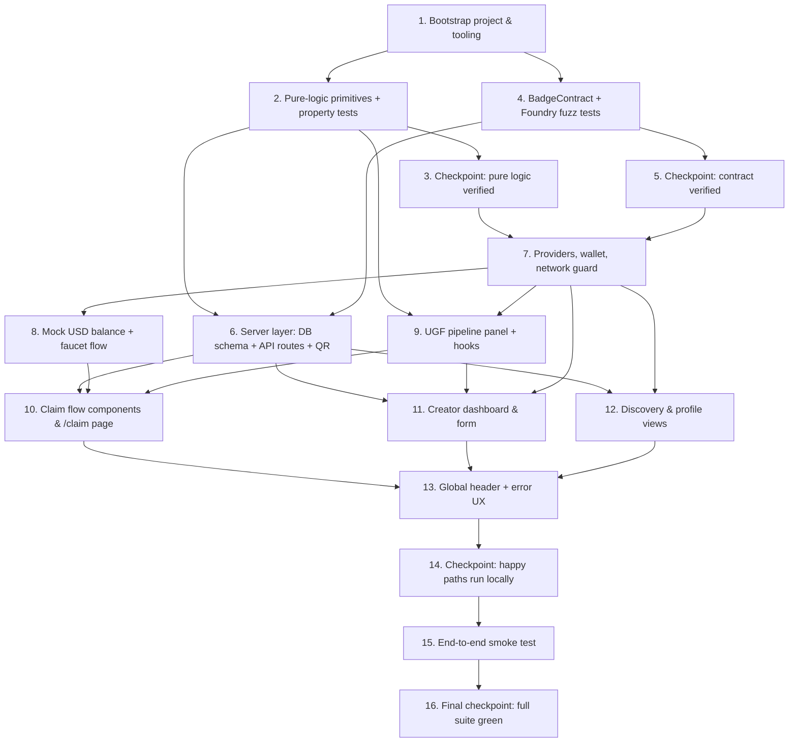

# Implementation Plan: Proof — Gasless POAP Badges

## Overview

Convert the feature design into a series of prompts for a code-generation LLM that will implement each step with incremental progress. Make sure that each prompt builds on the previous prompts, and ends with wiring things together. There should be no hanging or orphaned code that isn't integrated into a previous step. Focus ONLY on tasks that involve writing, modifying, or testing code.

The implementation is structured as a DAG-friendly sequence:

1. **Foundation** (project skeleton, env, tooling) → unblocks everything.
2. **Pure logic + property tests** (status, eligibility, validation, filtering, sorting, claim links, onboarding gating, pipeline mapper, badge grouping) → testable with zero infrastructure.
3. **Smart contract** (BadgeContract + Foundry fuzz tests for soulbound and storage) → can run in parallel with frontend logic.
4. **Server layer** (Drizzle schema, /api/upload, /api/campaigns, QR route) → depends on pure logic.
5. **Frontend integration** (providers, wallet, network guard, UGF hooks, components, pages) → depends on server + contract addresses.
6. **End-to-end wiring + checkpoints**.

Stack: Next.js 14 App Router + TypeScript, Tailwind + shadcn/ui, wagmi v2 + viem, `@tychilabs/react-ugf`, drizzle-orm + postgres, Vercel Blob, Foundry, Vitest + fast-check, Playwright.

## Tasks

- [x] 1. Bootstrap the Next.js project and tooling
  - Initialize Next.js 14 App Router + TypeScript project at the repo root.
  - Install Tailwind CSS, configure `tailwind.config.ts` and `globals.css`.
  - Install shadcn/ui, generate `Button`, `Card`, `Input`, `Label`, `Dialog`, `Toast`, `Form`, `Badge`, `Skeleton` primitives.
  - Install runtime deps: `wagmi`, `viem`, `@tanstack/react-query`, `@tychilabs/react-ugf`, `@tychilabs/ugf-testnet-js`, `zod`, `drizzle-orm`, `postgres`, `@vercel/blob`, `qrcode`.
  - Install dev deps: `vitest`, `@vitest/ui`, `@testing-library/react`, `@testing-library/jest-dom`, `jsdom`, `fast-check`, `msw`, `playwright`, `drizzle-kit`, `@types/qrcode`.
  - Create `vitest.config.ts` with jsdom env, path aliases matching `tsconfig.json`.
  - Create `.env.example` with `DATABASE_URL`, `BLOB_READ_WRITE_TOKEN`, `NEXT_PUBLIC_BADGE_CONTRACT`, `NEXT_PUBLIC_MOCK_USD`, `NEXT_PUBLIC_WALLETCONNECT_PROJECT_ID`, `NEXT_PUBLIC_BASE_SEPOLIA_RPC`.
  - Set up `lib/env.ts` with a zod-validated env loader (server) and a `lib/public-env.ts` for `NEXT_PUBLIC_*` consts.
  - _Requirements: All (foundation)_

- [x] 2. Implement pure-logic primitives with property tests
  - [x] 2.1 Implement `deriveStatus` and `CampaignStatus` types
    - Create `lib/status.ts` exporting `CampaignStatus` and `deriveStatus({startTime,endTime,maxSupply,mintedCount}, now): CampaignStatus`.
    - Status precedence: `sold_out` (mintedCount >= maxSupply) → `upcoming` (now < startTime) → `ended` (now >= endTime) → `active`.
    - _Requirements: 1.6_

  - [x]* 2.2 Property test: deriveStatus correctness
    - **Property 2: Campaign status derivation**
    - **Validates: Requirements 1.6**
    - File: `lib/status.test.ts`. Use `fast-check` to generate `(startTime, endTime, maxSupply, mintedCount, now)` honoring `endTime > startTime` and `0 ≤ mintedCount ≤ maxSupply`. Assert exhaustive precedence-ordered case mapping. Min 100 iterations.

  - [x] 2.3 Implement claim eligibility predicates
    - Create `lib/eligibility.ts` exporting `canClaim({status, alreadyClaimed, balance, quote}): boolean` and `showFaucet({balance, quote}): boolean`.
    - `canClaim` true iff `status === "active" && !alreadyClaimed && balance >= quote`.
    - `showFaucet` true iff `balance < quote`. Independent from `canClaim`.
    - _Requirements: 1.5, 1.7, 3.4_

  - [x]* 2.4 Property test: eligibility predicates
    - **Property 1: Claim eligibility predicate**
    - **Validates: Requirements 1.5, 1.7, 3.4**
    - File: `lib/eligibility.test.ts`. fast-check generates random `(status, alreadyClaimed, balance, quote)` tuples. Min 100 iterations.

  - [x] 2.5 Implement campaign form validation
    - Create `lib/validate-campaign.ts` exporting `validateCampaignForm(input): {valid: true} | {valid: false; errors: Record<string,string>}`.
    - Rules: name length 1..80, description length 0..500, imageUrl non-empty, maxSupply 1..10000, endTime > startTime, soulbound is boolean.
    - Export the underlying `campaignSchema` (zod) for shared client/server use.
    - _Requirements: 5.1, 5.2, 5.3_

  - [x]* 2.6 Property test: campaign form validation
    - **Property 4: Campaign form validation**
    - **Validates: Requirements 5.1, 5.2, 5.3**
    - File: `lib/validate-campaign.test.ts`. fast-check generates random and adversarial inputs at boundaries (0, 1, 9999, 10000, 10001 for supply; equal/inverted timestamps; oversize strings). Min 100 iterations.

  - [x] 2.7 Implement image upload validation
    - Create `lib/validate-image.ts` exporting `validateImageUpload({sizeBytes, declaredExtension, magicBytes}): {valid: true} | {valid: false; reason}`.
    - Magic-byte sniffing: PNG `89 50 4E 47`, JPEG `FF D8 FF`, GIF `47 49 46 38`, WEBP `52 49 46 46 .. .. .. .. 57 45 42 50`.
    - Allowlist extensions: `png`, `jpg`, `jpeg`, `webp`, `gif`. JPEG matches both `.jpg` and `.jpeg`.
    - Reject when sniffed type and declared extension disagree (e.g., PNG bytes with `.jpg` extension).
    - Reject `sizeBytes > 2 * 1024 * 1024`.
    - _Requirements: 5.6_

  - [x]* 2.8 Property test: image upload validation
    - **Property 5: Image upload validation**
    - **Validates: Requirements 5.6**
    - File: `lib/validate-image.test.ts`. fast-check generates `(sizeBytes, declaredExtension, magicBytes)` tuples including adversarial mismatches. Min 100 iterations.

  - [x] 2.9 Implement claim link helpers
    - Create `lib/claim-link.ts` exporting `buildClaimLink(campaignId: string): string` (returns `/claim/${campaignId}`) and `parseClaimLink(path: string): string | null`.
    - _Requirements: 8.1_

  - [x]* 2.10 Property test: claim link round-trip
    - **Property 8: Claim link round-trip**
    - **Validates: Requirements 8.1**
    - File: `lib/claim-link.test.ts`. fast-check generates decimal-string `campaignId` values. Assert `parseClaimLink(buildClaimLink(id)) === id`. Min 100 iterations.

  - [x] 2.11 Implement onboarding step gating
    - Create `lib/onboarding.ts` exporting `canEnableStep3({step1Done, step2Done, balance}): boolean`.
    - Returns `step1Done && step2Done`. Balance MUST NOT influence the result.
    - _Requirements: 9.3_

  - [x]* 2.12 Property test: onboarding step gating
    - **Property 9: Onboarding step gating**
    - **Validates: Requirements 9.3**
    - File: `lib/onboarding.test.ts`. fast-check generates random `balance` values; assert result depends only on the two booleans. Min 100 iterations.

  - [x] 2.13 Implement campaign sort and search helpers
    - Create `lib/sort-campaigns.ts` with `sortCampaignsByRecency(list)` returning a permutation sorted by `createdAt DESC`.
    - Create `lib/filter-campaigns.ts` with `filterCampaigns(list, q)` performing case-insensitive substring match against `name` and `creator`. Empty `q` returns the list unchanged.
    - _Requirements: 12.1, 12.3_

  - [x]* 2.14 Property test: discovery sort order
    - **Property 12: Discovery sort order**
    - **Validates: Requirements 12.1**
    - File: `lib/sort-campaigns.test.ts`. fast-check generates lists of campaigns with random `createdAt` values; assert output is permutation and adjacent pairs satisfy `>=`. Min 100 iterations.

  - [x]* 2.15 Property test: discovery search filter
    - **Property 13: Discovery search filter**
    - **Validates: Requirements 12.3**
    - File: `lib/filter-campaigns.test.ts`. fast-check generates `(list, q)`; assert soundness + completeness + empty-query identity. Min 100 iterations.

  - [x] 2.16 Implement badge grouping helper
    - Create `lib/group-badges.ts` exporting `groupBadgesByCampaign(badges): Record<string, Badge[]>`.
    - _Requirements: 7.2_

  - [x]* 2.17 Property test: badge grouping
    - **Property 7: Badge grouping**
    - **Validates: Requirements 7.2**
    - File: `lib/group-badges.test.ts`. fast-check generates random badge lists; assert every input appears in exactly one group keyed by its own `campaignId` and the multiset union equals the input. Min 100 iterations.

  - [x] 2.18 Implement UGF pipeline state mapper
    - Create `lib/pipeline.ts` with types `StageStatus`, `PipelineUiState`, and `mapSdkEventToPipelineState(prevState, event): PipelineUiState`.
    - Implement state machine: `idle → quote → settle → execute → confirm → success`, with transitions to `failed` from any active stage.
    - On `retry()` from failed at stage S, reset S to `active`, preserve earlier `success` stages.
    - _Requirements: 1.3, 2.5, 10.1, 10.2_

  - [x]* 2.19 Property test: UGF pipeline state machine
    - **Property 3: UGF pipeline state machine monotonicity**
    - **Validates: Requirements 1.3, 2.5, 10.1, 10.2**
    - File: `hooks/use-ugf-pipeline.test.ts`. fast-check generates random valid SDK event sequences (including `failure` and `retry` events). Assert: (a) stage success ordering, (b) at-most-one-active, (c) failure halts subsequent, (d) retry resumes from failed stage. Min 200 iterations.

- [x] 3. Checkpoint — pure logic verified
  - Run `npm run test`. Ensure all property tests pass. Ask the user if questions arise.

- [x] 4. Implement and test the BadgeContract (Foundry)
  - [x] 4.1 Scaffold the Foundry workspace
    - Create `contracts/` subdirectory with `foundry.toml`, `lib/forge-std`, `lib/openzeppelin-contracts`.
    - Configure remappings in `remappings.txt` for `@openzeppelin/` and `forge-std/`.
    - _Requirements: 11.5_

  - [x] 4.2 Implement `BadgeContract.sol`
    - Create `contracts/src/BadgeContract.sol` per the design's contract spec.
    - Storage: `Campaign` struct (creator, maxSupply, mintedCount, startTime, endTime, soulbound, exists), `campaigns` mapping, `hasClaimed` mapping, `tokenIdToCampaign` mapping, `campaignBaseURI` mapping, `nextCampaignId`, `nextTokenId`.
    - `createCampaign(maxSupply, startTime, endTime, soulbound, baseURI) returns (campaignId)` validating `1 ≤ maxSupply ≤ 10000` and `endTime > startTime`.
    - `claim(campaignId)` enforces window, supply, one-claim-per-wallet; emits `BadgeClaimed`.
    - Override `_update` to revert with `SoulboundTransfer` when token belongs to a soulbound campaign and is not a mint.
    - `tokenURI(tokenId)` returns `campaignBaseURI[tokenIdToCampaign[tokenId]]`.
    - Inherit `ERC721Enumerable` from OpenZeppelin v5 to support `tokenOfOwnerByIndex` for the gallery.
    - _Requirements: 1.2, 1.6, 1.7, 5.1, 6.1, 6.2, 11.5_

  - [x]* 4.3 Foundry fuzz test: createCampaign storage round-trip
    - **Property 11: BadgeContract createCampaign storage round-trip**
    - **Validates: Requirements 11.5**
    - File: `contracts/test/BadgeContract.createCampaign.t.sol`. Use `forge-std` `bound` to constrain inputs. Assert post-call storage equals input across `maxSupply`, `startTime`, `endTime`, `soulbound`, `baseURI`, with `creator == msg.sender`, `mintedCount == 0`, `exists == true`. Default 256 fuzz runs.

  - [x]* 4.4 Foundry fuzz test: soulbound transfer enforcement
    - **Property 6: Soulbound transfer enforcement**
    - **Validates: Requirements 6.1, 6.2**
    - File: `contracts/test/BadgeContract.soulbound.t.sol`. Two fuzz tests: (a) for soulbound campaigns, `vm.expectRevert(SoulboundTransfer.selector)` on `transferFrom` and `safeTransferFrom`; (b) for non-soulbound campaigns, transfer succeeds and ownership updates. Mints (`from == address(0)`) succeed regardless. Set `runs = 1000` via inline forge config.

  - [x] 4.5 Implement deploy script
    - Create `contracts/script/Deploy.s.sol` deploying `BadgeContract` to Base Sepolia, printing the address.
    - Document `forge script ... --rpc-url base_sepolia --broadcast --verify` invocation in `contracts/README.md`.
    - _Requirements: 11.5_

  - [x] 4.6 Export ABI + address consts to the frontend
    - Add a build step (or commit-time copy) that writes the ABI to `lib/abi/badge-contract.json`.
    - Update `lib/public-env.ts` to expose `BADGE_CONTRACT_ADDRESS` from `NEXT_PUBLIC_BADGE_CONTRACT`.
    - _Requirements: 1.2, 5.1, 11.3_

- [x] 5. Checkpoint — contract verified
  - Run `forge test -vvv` in `contracts/`. Ensure both fuzz suites pass. Ask the user if questions arise.

- [x] 6. Implement the server layer (database, API routes)
  - [x] 6.1 Define Drizzle schema and migrations
    - Create `lib/db/schema.ts` with the `campaigns` table per design.
    - Create `lib/db/index.ts` exporting a `drizzle` client built from `postgres(env.DATABASE_URL)`.
    - Generate the initial migration via `drizzle-kit generate`; commit the SQL.
    - _Requirements: 11.1_

  - [x] 6.2 Implement `POST /api/upload`
    - Create `app/api/upload/route.ts`. Parse multipart, enforce 2 MB cap.
    - Read first 12 bytes, call `validateImageUpload`. On failure return 400 with the rule violated.
    - Upload to Vercel Blob under `campaigns/${randomUUID()}.${ext}`. Return `{ url }`.
    - _Requirements: 5.6, 11.2_

  - [ ]* 6.3 Integration test: /api/upload validation
    - File: `app/api/upload/route.test.ts`. Use direct route invocation with mocked Vercel Blob.
    - Cover: oversize → 400; mismatched magic/extension → 400; valid PNG → 201 with URL.
    - _Requirements: 5.6, 11.2_

  - [x] 6.4 Implement `POST /api/campaigns` and `GET /api/campaigns`
    - Create `app/api/campaigns/route.ts`. Validate POST body with shared zod schema.
    - On POST: verify on-chain that `campaigns(campaignId).creator == body.creator` via a server-side viem client; insert row. Return 201.
    - On GET: optional `q` query param, filter via SQL `LOWER(name) LIKE %q%` OR `LOWER(creator) LIKE %q%`. Limit 60, order by `created_at DESC`.
    - _Requirements: 11.1, 11.3, 12.1, 12.3_

  - [x] 6.5 Implement `GET /api/campaigns/[id]`
    - Create `app/api/campaigns/[id]/route.ts` returning the row or 404.
    - _Requirements: 11.3, 11.4, 8.4_

  - [x]* 6.6 Property test: campaign metadata round-trip via API
    - **Property 10: Campaign metadata round-trip via API**
    - **Validates: Requirements 11.1**
    - File: `app/api/campaigns/route.test.ts`. Use a test database (pg-mem or a local container) and mocked viem `readContract`. fast-check generates payloads accepted by `validateCampaignForm`; POST then GET; assert deep equality on persisted fields. Min 100 iterations.

  - [x] 6.7 Implement `GET /api/qr`
    - Create `app/api/qr/route.ts`. Read `campaignId` query param, generate PNG QR encoding the absolute claim URL via `qrcode.toBuffer`. Return `image/png` with `Content-Disposition: attachment`.
    - _Requirements: 8.2_

- [x] 7. Implement frontend providers, wallet, and network UX
  - [x] 7.1 Implement `Providers`
    - Create `app/providers.tsx` wrapping the app in wagmi's `WagmiProvider`, `QueryClientProvider`, and `@tychilabs/react-ugf` provider configured for Base Sepolia (chainId 84532) and the deployed BadgeContract.
    - Create `lib/wagmi.ts` exporting the wagmi config (injected + WalletConnect connectors, Base Sepolia chain definition).
    - _Requirements: 4.1, 4.2_

  - [x] 7.2 Implement `WalletButton` and `useNetworkGuard`
    - Create `components/wallet-button.tsx` with connect/disconnect UI and address chip.
    - Create `hooks/use-network-guard.ts` exposing `{ isCorrectNetwork, switchToBaseSepolia, addBaseSepolia }`.
    - _Requirements: 4.1, 4.2, 4.3, 4.4_

  - [x] 7.3 Implement `NetworkGuard`
    - Create `components/network-guard.tsx` rendering a banner + disabling children when on wrong chain. Banner has "Switch to Base Sepolia" then "Add Base Sepolia" fallback.
    - _Requirements: 4.3, 4.4_

  - [ ]* 7.4 Component test: wallet + network guard
    - File: `components/wallet-button.test.tsx`, `components/network-guard.test.tsx`.
    - Mock wagmi with `@wagmi/test`. Cover: not connected → connect button; wrong chain → banner + disabled children; correct chain → children rendered enabled; rejected switch → "Add Base Sepolia" surfaces.
    - _Requirements: 4.1–4.4_

  - [x] 7.5 Implement disconnect cache invalidation
    - In `Providers`, listen to wagmi's account-change events and call `queryClient.removeQueries({ queryKey: ['wallet'] })` on disconnect.
    - _Requirements: 4.5_

- [x] 8. Implement Mock USD balance and faucet flow
  - [x] 8.1 Implement `useMockUsdBalance`
    - Create `hooks/use-mock-usd-balance.ts` reading `balanceOf(account)` from the Mock USD ERC-20 contract. Polling: 5 s while `faucetActive` flag set, otherwise on window focus.
    - _Requirements: 3.1, 3.3_

  - [x] 8.2 Implement `MockUsdBalance` component with faucet button
    - Create `components/mock-usd-balance.tsx` rendering a header chip with the formatted balance and a "Get Mock USD" button that opens `https://universalgasframework.com/faucets?address={wallet}` in a new tab and toggles `faucetActive`.
    - When balance ≤ most-recent-quote, button is visually prominent (uses `Button` `variant="default"`); otherwise muted.
    - _Requirements: 3.1, 3.2, 3.4_

  - [ ]* 8.3 Component test: faucet flow
    - File: `components/mock-usd-balance.test.tsx`. Mock `window.open`, advance fake timers, simulate balance increase, assert chip refresh and any registered `onBalanceIncrease` callback fires.
    - _Requirements: 3.1, 3.2, 3.3_

- [x] 9. Implement the UGF pipeline panel and hooks
  - [x] 9.1 Implement `UgfPipelinePanel`
    - Create `components/ugf-pipeline-panel.tsx` rendering the four stages (`quote`, `settle`, `execute`, `confirm`) with status icons (pending, active=spinner, success=check, failed=cross).
    - Display Mock USD quote and ETH-saved estimate after `quote` success; display tx hash with BaseScan link after `execute` success; display error message + "Retry" button on failure.
    - Driven by `PipelineUiState` from `lib/pipeline.ts`.
    - _Requirements: 2.1, 2.2, 2.3, 2.4, 2.5_

  - [x] 9.2 Implement `useUgfClaim`
    - Create `hooks/use-ugf-claim.ts` wrapping `@tychilabs/react-ugf`'s transaction hook for `BadgeContract.claim(campaignId)`. Map SDK output through `mapSdkEventToPipelineState` to expose `pipeline: PipelineUiState`.
    - Expose `{ claim, pipeline, retry, reset, txHash, quote }`. Implement a 10-second timeout on the `quote` stage via `Promise.race`; on timeout mark `quote` failed with message "UGF service unavailable, retry".
    - _Requirements: 1.2, 1.3, 1.4, 2.5, 10.1, 10.2, 10.4_

  - [x] 9.3 Implement `useUgfCreateCampaign`
    - Create `hooks/use-ugf-create-campaign.ts` mirroring `useUgfClaim` for `BadgeContract.createCampaign(...)`. Exposes the resulting `campaignId` parsed from the `CampaignCreated` event log.
    - _Requirements: 5.1, 5.4_

  - [ ]* 9.4 Component test: UgfPipelinePanel renders all states
    - File: `components/ugf-pipeline-panel.test.tsx`. Render with each `PipelineUiState` shape: idle, quote-active, quote-success-with-cost, execute-success-with-hash, confirm-success, each-stage-failed-with-error. Assert correct status icons and presence of BaseScan link.
    - _Requirements: 2.1, 2.3, 2.4, 2.5_

- [x] 10. Implement claim flow components
  - [x] 10.1 Implement `useCampaign`
    - Create `hooks/use-campaign.ts` joining `GET /api/campaigns/[id]` + on-chain `campaigns(id)` + `hasClaimed(id, wallet)` reads. Returns `{ campaign, supply: {minted,max}, alreadyClaimed, status, isLoading, error }`.
    - On null DB record return error type `metadata_unavailable`. On null on-chain campaign return `not_found`.
    - _Requirements: 1.1, 1.6, 1.7, 8.4, 11.3, 11.4_

  - [x] 10.2 Implement `OnboardingSteps`
    - Create `components/onboarding-steps.tsx` rendering three ordered steps. Step 2 has a manual "I got Mock USD" button; only that click sets `step2Done`. Step 3 disabled per `canEnableStep3`.
    - _Requirements: 9.1, 9.2, 9.3_

  - [x] 10.3 Implement `ClaimCard`
    - Create `components/claim-card.tsx` rendering campaign metadata, status pill, supply badge, and the "Claim Badge" CTA. Uses `canClaim` and `showFaucet` to gate UI. Renders `OnboardingSteps` above the CTA when no wallet connected.
    - On click → `useUgfClaim().claim(campaignId)`. Renders `UgfPipelinePanel` while pipeline is active. On success: render minted Badge image, token id, and BaseScan link.
    - On revert during execute/confirm: refresh `useCampaign` (to re-read mintedCount/hasClaimed) and display revert reason.
    - _Requirements: 1.1, 1.2, 1.4, 1.5, 1.6, 1.7, 9.4, 10.3_

  - [x] 10.4 Implement `/claim/[campaignId]/page.tsx`
    - Server component fetching `GET /api/campaigns/[id]`. If 404, render "Campaign not found" empty state (takes precedence over wallet prompts). Otherwise hydrate `ClaimCard`.
    - _Requirements: 1.1, 8.4, 11.4_

  - [ ]* 10.5 Component test: ClaimCard happy and blocked paths
    - File: `components/claim-card.test.tsx`. Cover: not started → CTA disabled with reason "not_started"; ended → "ended"; sold_out → "sold_out"; already claimed → "Already claimed"; insufficient balance → CTA blocked + "Get Mock USD" prominent; happy path → calls claim and renders pipeline panel.
    - _Requirements: 1.1, 1.5, 1.6, 1.7_

- [x] 11. Implement creator dashboard and form
  - [x] 11.1 Implement `CampaignForm`
    - Create `components/campaign-form.tsx` with shadcn `Form` + `react-hook-form` + zod resolver using the shared `campaignSchema`.
    - File input runs client-side `validateImageUpload` on the file's first 12 bytes (via `FileReader`) before POSTing to `/api/upload`.
    - On submit: upload image → call `useUgfCreateCampaign().create(...)` → on confirm parse `CampaignCreated` event → POST `/api/campaigns` → navigate to `/creator?new={campaignId}`.
    - _Requirements: 5.1, 5.2, 5.3, 5.6, 11.1, 11.2_

  - [x] 11.2 Implement `QrDownloadButton`
    - Create `components/qr-download-button.tsx` rendering an anchor `<a href="/api/qr?campaignId={id}" download>Download QR</a>`.
    - _Requirements: 8.2_

  - [x] 11.3 Implement `/creator/new/page.tsx`
    - Server component rendering `<NetworkGuard><CampaignForm /></NetworkGuard>`. Renders `UgfPipelinePanel` from the `useUgfCreateCampaign` hook during submission.
    - _Requirements: 5.1, 5.4, 4.4_

  - [x] 11.4 Implement `CampaignCard` and creator dashboard list
    - Create `components/campaign-card.tsx` rendering image, name, creator (truncated `0x1234…abcd`), supply badge, status pill (via `deriveStatus`), `Claim` link, optional `Copy Link` and `QrDownloadButton`.
    - Create `app/creator/page.tsx` server component fetching campaigns where `creator = connectedWallet` and rendering a list of `CampaignCard`s with management controls.
    - _Requirements: 5.5, 12.2_

  - [ ]* 11.5 Component test: campaign creation flow
    - File: `components/campaign-form.test.tsx`. Cover: validation rejection (bad supply, bad window, bad image extension); successful flow with mocked upload + UGF hook + API; navigation to dashboard after success.
    - _Requirements: 5.1, 5.2, 5.3, 5.4, 5.6_

- [x] 12. Implement discovery and profile views
  - [x] 12.1 Implement `DiscoveryGrid`
    - Create `components/discovery-grid.tsx` taking a `Campaign[]` prop. Debounced (200 ms) search input applies `filterCampaigns` client-side. Renders sorted grid via `sortCampaignsByRecency`.
    - _Requirements: 12.1, 12.2, 12.3_

  - [x] 12.2 Implement `/page.tsx` (home / Discovery)
    - Server component fetching `GET /api/campaigns` (limit 60). Hydrate `DiscoveryGrid`. No wallet required.
    - _Requirements: 12.1, 12.2, 12.4_

  - [x] 12.3 Implement `useOwnedBadges`
    - Create `hooks/use-owned-badges.ts` using viem multicall: `balanceOf(address)` then `tokenOfOwnerByIndex(address, i)` for `i in 0..n`. For each tokenId resolve `tokenIdToCampaign(tokenId)` and map to its campaign. Group via `groupBadgesByCampaign`.
    - _Requirements: 7.2_

  - [x] 12.4 Implement `BadgeGrid`
    - Create `components/badge-grid.tsx` taking `address` prop. When `useOwnedBadges` returns zero badges, render only the empty state ("No badges yet" + "Find a Campaign" CTA → `/`). Otherwise render groups by campaign with image, name, mint timestamp, token id, and a "Soulbound" indicator when applicable.
    - _Requirements: 6.3, 7.1, 7.2, 7.5_

  - [x] 12.5 Implement `/me/page.tsx` and `/profile/[address]/page.tsx`
    - `/me`: client component reading `useAccount()` then rendering `BadgeGrid`. Includes a "Share" button copying `/profile/{address}` to clipboard.
    - `/profile/[address]`: validates address with viem `isAddress`; renders `BadgeGrid` without requiring wallet connection.
    - _Requirements: 7.2, 7.3, 7.4_

  - [ ]* 12.6 Component test: profile empty state and share
    - File: `components/badge-grid.test.tsx`, `app/profile/[address]/page.test.tsx`. Cover: zero badges → only empty state, no skeleton grid; non-zero → groups; "Share" button calls `navigator.clipboard.writeText`.
    - _Requirements: 7.1, 7.4, 7.5_

- [x] 13. Wire global header and error UX
  - [x] 13.1 Implement `app/layout.tsx`
    - Wrap children in `Providers`. Add a header: app name, `WalletButton`, `MockUsdBalance`, links to `/`, `/creator`, `/me`.
    - _Requirements: 3.1, 4.1_

  - [x] 13.2 Implement central `mapErrorToUiMessage`
    - Create `lib/errors.ts` exporting `mapErrorToUiMessage(error): { stage?, code, message }` covering: SDK network/RPC errors, `user_rejected`, on-chain reverts (`NotStarted`, `Ended`, `SoldOut`, `AlreadyClaimed`, `SoulboundTransfer`, `InvalidWindow`, `InvalidSupply`), UGF timeout, image validation failures.
    - Wire into `UgfPipelinePanel`, `ClaimCard`, and `CampaignForm`.
    - _Requirements: 10.1, 10.2, 10.3, 10.4_

- [x] 14. Checkpoint — happy paths run locally
  - Run `npm run test`, `forge test -vvv`, and `npm run dev`. Manually walk: create campaign → copy claim link → open in new wallet → claim. Ensure all tests pass. Ask the user if questions arise.
  - _Requirements: 1.1, 1.2, 1.3, 1.4, 9.1–9.4_

- [ ] 15. End-to-end smoke test
  - [ ]* 15.1 Playwright happy path
    - File: `e2e/claim.spec.ts`. Use a mocked UGF SDK (or a stub provider) and a fixture campaign.
    - Walk: visit `/`, find a campaign, open `/claim/[id]`, connect mock wallet, mark step 2 complete, click Claim, assert pipeline progresses through all four stages, assert minted-badge state renders.
    - _Requirements: 1.1, 1.2, 1.3, 1.4, 9.1–9.4_

- [x] 16. Final checkpoint — full suite green
  - Run `npm run test`, `forge test -vvv`, `npm run lint`, and `npx playwright test`. Ensure every suite passes. Ask the user if questions arise.

## Task Dependency Graph



Wave-based execution plan (each wave's tasks may run in parallel; later waves depend on earlier ones):

```json
{
  "waves": [
    {
      "wave": 1,
      "tasks": ["1"],
      "description": "Bootstrap project, tooling, env, providers scaffold."
    },
    {
      "wave": 2,
      "tasks": ["2", "4"],
      "description": "Pure-logic primitives with property tests (TypeScript) and BadgeContract with Foundry fuzz tests (Solidity) run in parallel."
    },
    {
      "wave": 3,
      "tasks": ["3", "5"],
      "description": "Checkpoints verifying pure logic and the contract before integration."
    },
    {
      "wave": 4,
      "tasks": ["6", "7"],
      "description": "Server layer (DB + API + QR) and frontend providers/wallet/network guard. Both depend on prior waves; can run in parallel."
    },
    {
      "wave": 5,
      "tasks": ["8", "9"],
      "description": "Mock USD balance + faucet flow and UGF pipeline panel + hooks."
    },
    {
      "wave": 6,
      "tasks": ["10", "11", "12"],
      "description": "Claim page, creator dashboard/form, discovery and profile views — all consume the wave-5 hooks and wave-4 server."
    },
    {
      "wave": 7,
      "tasks": ["13"],
      "description": "Global header and central error UX wiring."
    },
    {
      "wave": 8,
      "tasks": ["14"],
      "description": "Local checkpoint: unit + property tests + manual happy path."
    },
    {
      "wave": 9,
      "tasks": ["15"],
      "description": "Playwright end-to-end smoke test."
    },
    {
      "wave": 10,
      "tasks": ["16"],
      "description": "Final checkpoint: full suite green."
    }
  ]
}
```

Parallel tracks within a wave:
- Within Task 2, sub-tasks 2.1–2.18 are independent and can be parallelized further.
- Within Wave 4, Tasks 6 and 7 share no files and can be developed by separate agents.

## Notes

- Tasks marked with `*` are optional and can be skipped for faster MVP delivery, but each one is mapped to a specific design property or requirement and is the recommended path for hackathon submission credibility.
- Property tests are placed close to the implementation that satisfies them so failures surface immediately.
- The single contract / many campaigns model means the contract is deployed once before Task 6.4 runs (since the API verifies on-chain creator). Set `NEXT_PUBLIC_BADGE_CONTRACT` after Task 4.5 deploys.
- Once tasks.md is created, this workflow is complete. Open `tasks.md` and click "Start task" next to any item to begin implementation.
