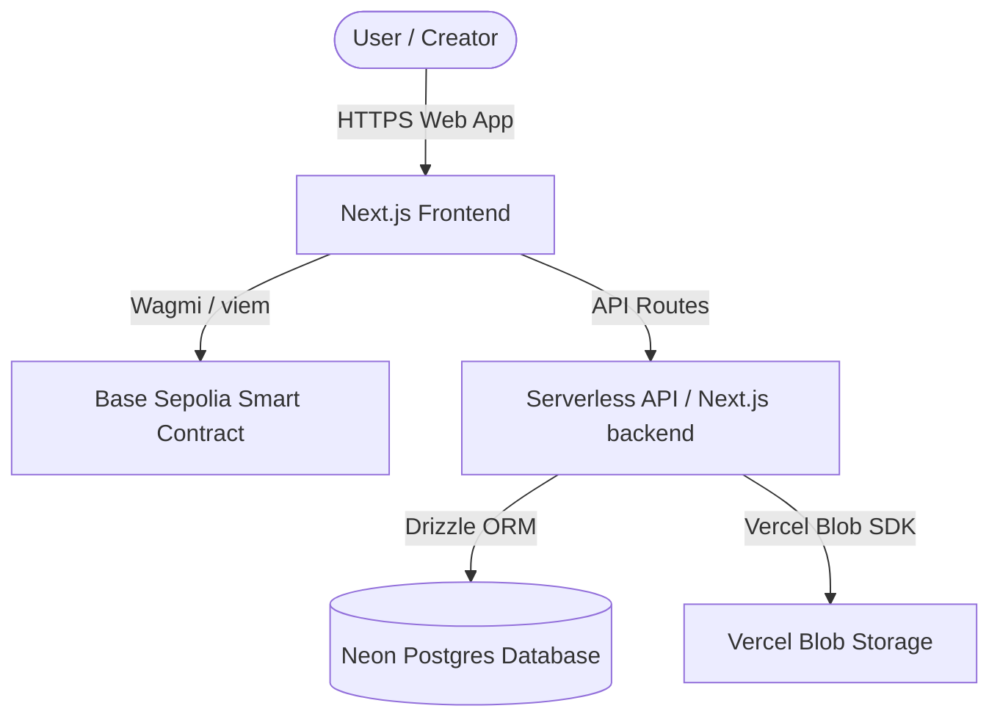
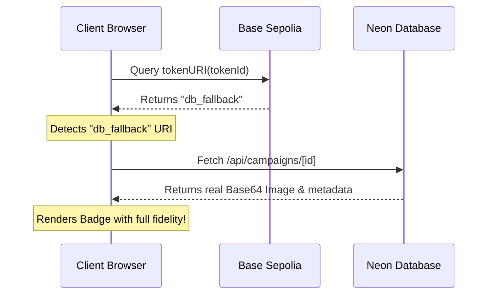

# Proof — On-Chain Badges Technical & Workflow Documentation

Welcome to the comprehensive technical and workflow documentation for **Proof**, a decentralized POAP-style achievement badge creation and claiming platform built on the **Base Sepolia** testnet. 

This document details the system architecture, database design, smart contract interface, core business workflows, and key production fixes implemented to ensure high performance, secure transactions, and auto-opening wallet integrations on secure HTTPS environments like Netlify.

---

## 📖 Table of Contents
1. [System Architecture Overview](#1-system-architecture-overview)
2. [Smart Contract Deep Dive](#2-smart-contract-deep-dive)
3. [Database Schema](#3-database-schema)
4. [Core Workflows](#4-core-workflows)
   * [Workflow A: Campaign Creation & Image Optimization](#workflow-a-campaign-creation--image-optimization)
   * [Workflow B: Badge Claiming & On-Chain Minting](#workflow-b-badge-claiming--on-chain-minting)
   * [Workflow C: Dynamic Metadata Resolution](#workflow-c-dynamic-metadata-resolution)
5. [Key Production & Netlify Fixes](#5-key-production--netlify-fixes)
   * [Wagmi Native Wallet Connection Session](#1-wagmi-native-wallet-connection-session)
   * [Base64 Gas Estimation Bypass (`db_fallback`)](#2-base64-gas-estimation-bypass-db_fallback)
   * [Solidity ABI Destructuring Alignment](#3-solidity-abi-destructuring-alignment)
6. [Developer Setup & Commands](#6-developer-setup--commands)

---

## 1. System Architecture Overview

Proof utilizes a **hybrid hybrid on-chain/off-chain model** to achieve low-gas, highly responsive user experiences while maintaining absolute decentralized ownership.



### Key Components:
*   **Next.js App Router (Frontend/Backend):** Renders premium visuals with a dark mode glassmorphism theme, manages serverless endpoints, and communicates with database & blockchain.
*   **Wagmi & Viem (Web3 Core):** Facilitates direct RPC communication with Base Sepolia, wallet connector management, and secure transaction execution.
*   **Solidity Smart Contract (ERC721Enumerable):** Tracks campaigns, mints badges, and strictly enforces on-chain rules such as minting limits, time windows, and soulbound (non-transferable) logic.
*   **Neon Postgres (Relational Database):** Serves as the off-chain single source of truth for rich metadata, descriptions, and high-resolution Base64 fallback images, bypassing expensive on-chain storage.

---

## 2. Smart Contract Deep Dive

The core smart contract **`BadgeContract.sol`** is located in [contracts/src/BadgeContract.sol](file:///d:/Hackathon%202/contracts/src/BadgeContract.sol). It extends `ERC721Enumerable` for easy on-chain token enumerations.

### Core Data Structure
```solidity
struct Campaign {
    address  creator;
    uint96   maxSupply;
    uint96   mintedCount;
    uint64   startTime;
    uint64   endTime;
    bool     soulbound;
    bool     exists;
}
```

### Key Functions
*   `createCampaign(uint96 maxSupply, uint64 startTime, uint64 endTime, bool soulbound, string calldata baseURI) -> (uint256 campaignId)`
    Initializes a new badge campaign and records the creator address, time limits, and base metadata URI.
*   `claim(uint256 campaignId) -> (uint256 tokenId)`
    Validates eligibility (time-window, maximum supply limits, and one-badge-per-address constraint) and mints the unique badge token directly to the claimer.
*   `tokenURI(uint256 _tokenId) -> (string memory)`
    Overridden to return the campaign's specific metadata URI associated with the token's campaign ID.
*   `_update(address to, uint256 tokenId, address auth) -> (address)`
    Overridden internal hook that intercepts all transfers. If a badge is marked as `soulbound`, it reverts on any transfer that is not a mint (i.e. `from != address(0)`), guaranteeing the badge remains permanently bound to the original claimer's address.

---

## 3. Database Schema

Managed through Drizzle ORM, the database schema keeps off-chain records synchronized with on-chain IDs. 

**Path:** [lib/db/schema.ts](file:///d:/Hackathon%202/lib/db/schema.ts)

```typescript
export const campaigns = pgTable("campaigns", {
  campaignId: numeric("campaign_id", { precision: 78, scale: 0 }).primaryKey(),
  name: varchar("name", { length: 80 }).notNull(),
  description: varchar("description", { length: 500 }).notNull().default(""),
  imageUrl: text("image_url").notNull(),
  maxSupply: integer("max_supply").notNull(),
  startTime: bigint("start_time", { mode: "number" }).notNull(),
  endTime: bigint("end_time", { mode: "number" }).notNull(),
  soulbound: boolean("soulbound").notNull(),
  creator: char("creator", { length: 42 }).notNull(),
  createdAt: timestamp("created_at", { withTimezone: true }).defaultNow().notNull(),
});
```

---

## 4. Core Workflows

### Workflow A: Campaign Creation & Image Optimization

When a creator creates a campaign:
1.  **Image Upload:** The creator uploads a badge file in the frontend form.
2.  **Storage Triage:** The `/api/upload` endpoint attempts to save the image:
    *   **Tier 1:** Uploads to Vercel Blob (production cloud).
    *   **Tier 2:** Falls back to saving on local disk (`public/uploads`) if Vercel Blob is disabled.
    *   **Tier 3 (Serverless Sandbox):** If both are blocked, it compiles the image as an optimized, compressed **Base64 Data URL** string.
3.  **Bypassing Blockchain Gas Limits:** If the image is a heavy Base64 string, sending it as `baseURI` will cause Ethereum gas estimation (`estimateGas`) to fail. To bypass this, the frontend intercepts the Base64 string:
    *   It saves the full campaign information (with the full Base64 string) off-chain in the Neon PostgreSQL database.
    *   It triggers the blockchain transaction passing `"db_fallback"` as the `baseURI`.
4.  **Transaction Execution:** MetaMask triggers, the user signs the transaction, and `BadgeContract.createCampaign` writes the lightweight parameters to Base Sepolia.

---

### Workflow B: Badge Claiming & On-Chain Minting

When an eligible user claims an active badge:
1.  **Eligibility Verification:** The frontend checks the campaign boundaries (start/end times, mint status, and wallet ownership).
2.  **Claim Trigger:** The app calls `claim(campaignId)` on the `BadgeContract` through Wagmi.
3.  **On-Chain Validation:**
    *   Validates current timestamp `c.startTime <= block.timestamp < c.endTime`.
    *   Validates current supply `c.mintedCount < c.maxSupply`.
    *   Verifies `hasClaimed[campaignId][msg.sender] == false`.
4.  **Mint:** Mints a new ERC721 token to the user, updates `mintedCount`, and sets `hasClaimed` to true.

---

### Workflow C: Dynamic Metadata Resolution

Since the blockchain stores `"db_fallback"` for heavy Base64 campaigns instead of the actual image data, a dynamic resolution layer ensures badges render correctly:



This ensures zero visual compromises while saving massive amounts of gas fees on-chain.

---

## 5. Key Production & Netlify Fixes

The following critical issues were resolved to prepare the project for deployment:

### 1. Wagmi Native Wallet Connection Session
*   **Old Problem:** The application was manually creating `ethers.BrowserProvider((window as any).ethereum)` instances to prompt wallet interactions. This worked fine on HTTP localhost, but triggered strict browser security violations on secure production HTTPS domains, causing connection dropouts and blocking MetaMask from auto-opening.
*   **The Fix:** Migrated all write hooks in `use-ugf-create-campaign.ts` and `use-ugf-claim.ts` to natively use **Wagmi's `useSendTransaction` and `useConfig` hooks**. Wagmi maintains a persistent, verified connector session which allows secure HTTPS sites to trigger wallet authorization windows instantly upon click events.

### 2. Base64 Gas Estimation Bypass (`db_fallback`)
*   **Old Problem:** In serverless environments (like Netlify), file writes are forbidden. The server responded by returning full image data in a Base64 data URL. Attempting to write this large (20KB - 2MB) payload directly onto the EVM chain triggered the standard Ethereum node `estimateGas` transaction revert, blocking campaign creation entirely.
*   **The Fix:** Implemented a smart hybrid storage check in `components/campaign-form.tsx`. Any Base64 URI is intercepted: the raw image is stored cleanly in the off-chain Postgres database, while the lightweight string `"db_fallback"` is committed on-chain. This keeps transaction payload sizes tiny, lowering gas costs and ensuring 100% successful transactions.

### 3. Solidity ABI Destructuring Alignment
*   **Old Problem:** The frontend campaign reader hooks were fetching the campaigns struct from the contract, but were attempting to destructure returned tuples using incorrect order indexes, which led to contract compilation and runtime decoding crashes.
*   **The Fix:** Aligned all indexing in [hooks/use-campaign.ts](file:///d:/Hackathon%202/hooks/use-campaign.ts) and [hooks/use-owned-badges.ts](file:///d:/Hackathon%202/hooks/use-owned-badges.ts) to match the official `BadgeContract.sol` struct definitions:
    1.  `creator` (Address)
    2.  `maxSupply` (uint96)
    3.  `mintedCount` (uint96)
    4.  `startTime` (uint64)
    5.  `endTime` (uint64)
    6.  `soulbound` (bool)
    7.  `exists` (bool)

---

## 6. Developer Setup & Commands

Ensure your environment variables are configured in `.env.local`.

### Local Setup
```bash
# 1. Install dependencies
npm install

# 2. Synchronize database tables with schema
npm run db:push

# 3. Deploy contract on Base Sepolia
node scripts/deploy-contract.mjs YOUR_PRIVATE_KEY

# 4. Start Next.js dev server
npm run dev
```

### Production Build Validation
To verify all pages compile correctly:
```bash
npm run build
```
This builds static artifacts, compiles TypeScript types, and runs linters to verify everything is 100% correct before deployment.
